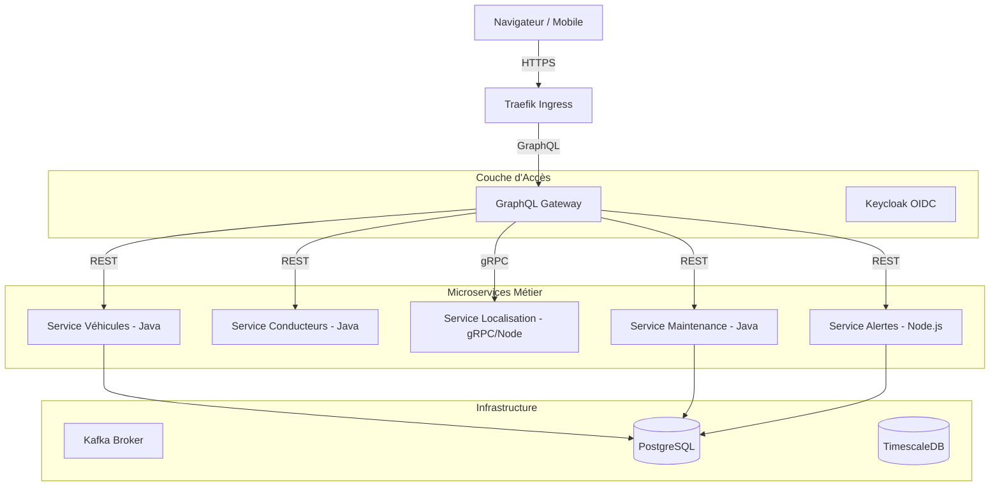

# Architecture Technique - Locare

Ce document détaille l'organisation interne et les flux de données de la plateforme Locare.

## 1. Vue d'ensemble des Services

L'application suit une architecture microservices découplée, orchestrée par Kubernetes (Helm).

## 2. Flux de Données Événementiel (Kafka)

Le système utilise Kafka pour propager les changements d'état sans coupler les services.

- **Topic `locare-vehicules`** : Émis par `Vehicules` lors d'une création/mise à jour. Consommé par `Alertes`.
- **Topic `maintenance-events`** : Émis par `Maintenance` lors d'un début/fin d'intervention. Consommé par `Vehicules` (pour changer le statut) et `Alertes`.

## 3. Modèle de Sécurité (RBAC)

La sécurité est gérée par **Keycloak** via des jetons JWT portés par le Frontend :
- **Gateway** : Vérifie la signature du jeton et valide les rôles.
- **Rôles** : 
    - `admin` : Peut modifier la flotte, les pilotes et les maintenances.
    - `ingenieur` : Accès limité à la gestion des maintenances.
    - `user` : Consultation uniquement.

## 4. Observabilité & Télémétrie

La plateforme est instrumentée pour la surveillance proactive :
- **Tracing (Jaeger)** : Suivi des requêtes traversant plusieurs services.
- **Metrics (Prometheus/Grafana)** : Indicateurs de performance (ex: nombre de véhicules en panne).
- **Logs (Loki)** : Centralisation des journaux d'erreurs.
- **Collector (OpenTelemetry)** : Agent central collectant toutes les traces et métriques.

## 5. Stack Technologique
- **Frontend** : React, TailwindCSS, Apollo Client.
- **Backend** : Spring Boot 3 (Java 17), Node.js (Express).
- **Inter-service** : Kafka, gRPC (Protocol Buffers).
- **Bases de données** : PostgreSQL, TimescaleDB.
- **Déploiement** : Docker, Kubernetes (Minikube), Helm.
